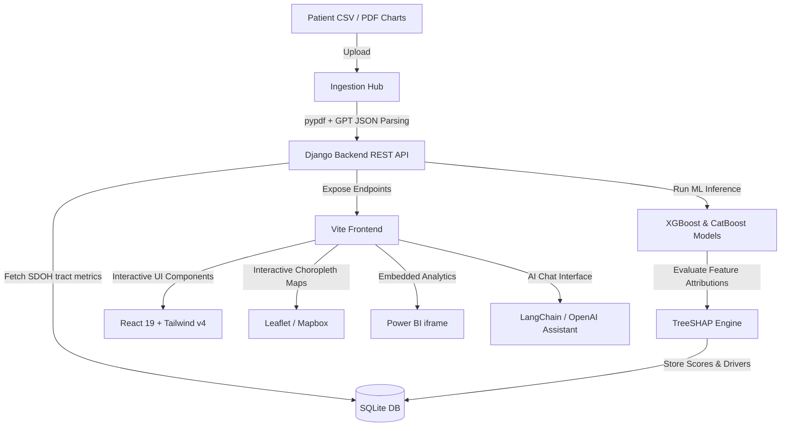

# CareSync SDOH — Clinical & Social Risk Prioritization Platform

CareSync SDOH is a state-of-the-art population health intelligence and risk stratification platform designed for modern care management teams. The application integrates individual clinical metrics with tract-level Social Determinants of Health (SDOH) to identify, predict, and address systemic health disparities.

The platform combines machine learning predictions (CatBoost/XGBoost), local geographic datasets, and LLM-powered conversational explanation to close the gap between population-level indicators and individual health outcomes.

---

## 📖 Table of Contents
1. [Demo Workflow Story](#-demo-workflow-story)
2. [Key Dashboards & Features](#-key-dashboards--features)
3. [System Architecture](#-system-architecture)
4. [Tech Stack](#-tech-stack)
5. [Installation & Setup](#-installation--setup)
6. [Environment Configurations](#-environment-configurations)
7. [Screenshots Gallery](#-screenshots-gallery)
8. [License & Contact](#-license--contact)

---

## 🔄 Demo Workflow Story

The platform is built to show a complete end-to-end clinical workflow:
> **Raw Data Ingestion ➔ Risk Understanding ➔ Explainability ➔ Population Intelligence ➔ Community Need ➔ Intervention ➔ Action**

1. **Raw Data Ingestion**: Bulk zip-code/diagnoses rosters or individual PDF clinical charts are parsed and imported.
2. **Risk Understanding**: Machine learning models run clinical and community risk assessments independently, merging them into a weighted care priority rank.
3. **Explainability**: Complex TreeSHAP feature attributions are translated into plain English narrative summaries using GPT-4o-mini and an interactive LangChain assistant.
4. **Population Intelligence**: Interactive choropleth risk maps and embedded Power BI reports highlight hot-spots of social vulnerability.
5. **Community Need**: Disparities are translated into targeted intervention strategies (e.g., housing support, food insecurity counseling).
6. **Action**: Outreach managers simulated-send AI-drafted municipal partnership emails to coordinate community resources.

---

## 🚀 Key Dashboards & Features

*   **📊 Overview Dashboard**: Renders bento KPI cards showing active cohort sizes, risk tier distributions, and live care pathway prevalence statistics (Housing Cost Burden, Economic Stability, and Healthcare Access).
*   **👥 Members Workspace**: A responsive grid interface displaying prioritized cohorts. Enables care managers to filter members dynamically by clinical/social driver type and CatBoost 3-class future risk forecasts.
*   **📄 Dynamic Two-Page PDF Reports**: Generates highly detailed printable patient summaries featuring:
    *   Dynamic AI Care Management summaries.
    *   12-month inpatient/emergency utilization metrics.
    *   Neighborhood-level census tract indicators.
    *   Future risk forecasting and threshold-based program referrals (e.g. LIHEAP utility coordination, food banks).
*   **🤖 AI Risk Understanding Assistant**: An interactive chat advisor mapping predictions, SHAP attributions, and clinical considerations into clear conversational guidance.
*   **📥 Patient Ingestion Hub**: File drag-and-drop intake console supporting CSV clinical rosters and PDF charts. Extracted charts are programmatically parsed via OpenAI's JSON mode.
*   **🗺️ Interactive Geographic Risk Map**: Displays Mapbox-powered regional tract polygons shaded by vulnerability. Features concentric ring charts in the sidebar mapping positive (risk-escalating) and negative (protective) SHAP attributions.
*   **📈 Power BI Analytics**: Seamless integration of Power BI reports (such as `"sdohrsik2"`) visualizing historical trends, poverty rates, and community risk indexes.
*   **🚨 Community Interventions**: County-level prioritization tracking tool highlighting resource capacities, gap margins, and active workflows. Features an outreach composer that drafts municipal emails using GPT.

---

## 🏗️ System Architecture



---

## 🛠️ Tech Stack

### Frontend
- **Core**: React 19 (TypeScript), React Router v7
- **Bundler & Server**: Vite 8
- **Styling**: Tailwind CSS v4
- **Charts & Maps**: Recharts, Leaflet, React-Leaflet
- **Authentication**: Firebase Authentication SDK

### Backend
- **Framework**: Django REST Framework (Python 3.12)
- **Database**: SQLite (default, supports PostgreSQL configuration)
- **AI/LLM Orchestration**: LangChain, OpenAI Python SDK (GPT-4o-mini)
- **ML & Data Pipeline**: CatBoost, XGBoost, Pandas, Numpy, PyPDF

---

## 💻 Installation & Setup

### Prerequisites
- [Node.js](https://nodejs.org/) (v18 or higher)
- [Python](https://www.python.org/) (v3.10 or higher)

### 1. Backend Setup (Django)
Navigate to the backend directory, initialize a virtual environment, install requirements, and run local migrations:

```bash
# Navigate to backend CWD
cd backend

# Create virtual environment
python -m venv .venv

# Activate virtual environment
# On Windows (PowerShell):
.venv\Scripts\Activate.ps1
# On Linux/macOS:
source .venv/bin/activate

# Install dependencies
pip install -r requirements.txt

# Run migrations
python manage.py migrate

# (Optional) Seed initial census tract SDOH records
python manage.py populate_patient_names.py

# Start local server
python manage.py runserver
```
*The backend server will run on `http://127.0.0.1:8000/`.*

### 2. Frontend Setup (React Vite)
Navigate to the frontend directory, install npm packages, and start the Vite development server:

```bash
# Navigate to frontend CWD
cd ../frontend

# Install dependencies
npm install

# Start dev server
npm run dev
```
*The frontend portal will run on `http://localhost:5173/`.*

---

## 🔒 Environment Configurations

### Backend Configuration (`backend/.env`)
Create a `.env` file in the root of the `backend/` directory:

```env
SECRET_KEY=django-insecure-your-secret-key-here
DEBUG=True
ALLOWED_HOSTS=localhost,127.0.0.1

# Database Configuration (Defaults to SQLite if omitted)
# DB_NAME=patient_sdoh
# DB_USER=postgres
# DB_PASSWORD=your_password
# DB_HOST=localhost
# DB_PORT=5432

# AI Services
OPENAI_API_KEY=your_openai_api_key_here
```

### Frontend Configuration
Vite is pre-configured to proxy `/api/` calls directly to `http://127.0.0.1:8000/` in `vite.config.ts`, ensuring fast responses and bypassing CORS resolution checks.

---

## 📸 Screenshots Gallery

For high-resolution previews and walkthroughs of each core dashboard component (Overview, Members Grid, Member Detail Drawer, AI Assistant, PDF Report Preview, Risk Map, Power BI embedded stats, and Interventions), refer to the interactive:

👉 **[dashboards_gallery.md](C:\Users\kavin\.gemini\antigravity-ide\brain\8c9ae817-123a-4d9f-924a-bf8a09ffd079\screenshots_gallery.md)**
